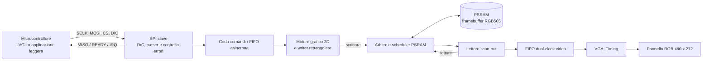
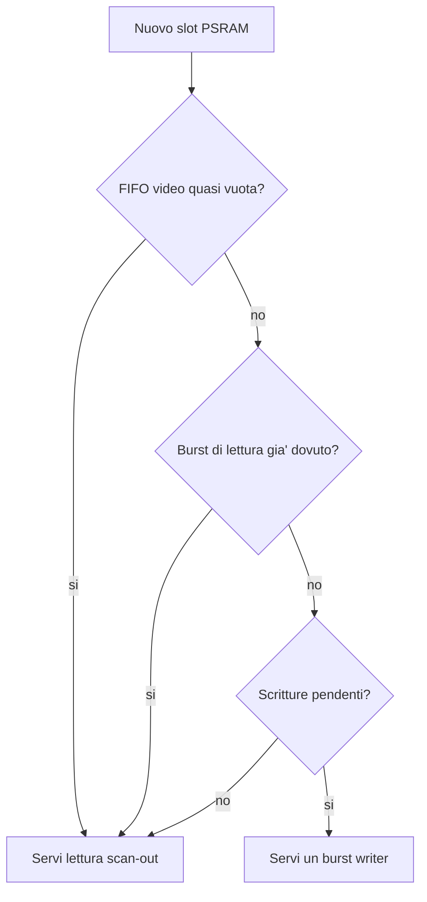
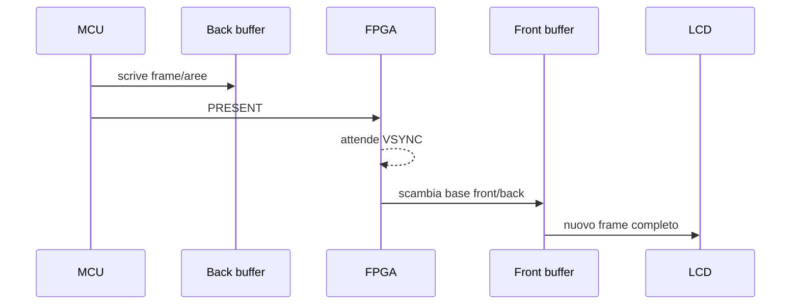

# Possibile controller display SPI per LVGL

> **Stato del documento: studio speculativo per sviluppi futuri.**
>
> Quanto segue non descrive funzionalita' gia' implementate e non costituisce
> una specifica definitiva. Raccoglie le idee, i vincoli e le alternative
> emersi durante una discussione preliminare, in modo da poter riprendere il
> lavoro senza dover ricostruire il contesto. Ogni scelta dovra' essere
> verificata contro le risorse FPGA, il comportamento dell'IP PSRAM, il
> microcontrollore host e la versione di LVGL effettivamente adottata.

## 1. Obiettivo ipotizzato

L'idea e' trasformare la Tang Nano 9K in un piccolo controller grafico:

- il pannello continua a ricevere dall'FPGA i segnali RGB paralleli e i timing;
- il framebuffer RGB565 continua a risiedere nella PSRAM integrata;
- un microcontrollore esterno diventa SPI master e aggiorna il framebuffer;
- LVGL puo' inviare rettangoli di pixel tramite una normale callback di flush;
- applicazioni prive di LVGL possono usare comandi grafici accelerati, come
  riempimenti, linee e caratteri bitmap.

Non si intende portare LVGL nell'FPGA. LVGL resta sul microcontrollore e, nella
modalita' normale, rasterizza autonomamente widget, testi e immagini.

## 2. Stato attuale del progetto

Il progetto pilota un pannello RGB565 da 480 x 272 pixel:

- `src/TOP.sv` integra clock, PSRAM, FIFO e uscita LCD;
- `src/VGA_Timing.sv` genera il raster e consuma due pixel RGB565 per parola
  da 32 bit;
- `src/FramebufferController.sv` inizializza la PSRAM con un pattern e poi la
  legge a burst per alimentare la FIFO video;
- `src/FramebufferFifo.sv` attraversa i domini di clock PSRAM/LCD;
- un impulso di `frame_restart` riallinea lettore PSRAM, FIFO e raster una
  volta per frame.

Il formato attuale osservato e':

```text
pixel RGB565: RRRRRGGGGGGBBBBB

parola PSRAM/FIFO a 32 bit:
  [15:0]  = pixel precedente, consumato per primo
  [31:16] = pixel successivo, consumato per secondo
```

Il frame completo occupa:

```text
480 * 272 * 2 = 261120 byte
```

La logica corrente emette otto beat da 32 bit per ogni burst di 16 pixel e poi
incrementa `addr` di 16. Prima di progettare il nuovo writer va confermato, sul
datasheet o con un test mirato, che l'unita' dell'indirizzo dell'IP PSRAM sia
effettivamente il pixel/halfword come lascia intendere il controller attuale.

## 3. Architettura proposta

`FramebufferController.sv` non deve necessariamente scomparire come file, ma
la sua responsabilita' monolitica andrebbe separata. La generazione del pattern
di test verrebbe rimossa o mantenuta solo come modalita' diagnostica.



Una possibile suddivisione RTL e':

- `SpiSlave`: acquisizione bit/byte nel dominio SCLK;
- `SpiCommandParser`: decodifica comandi, parametri, lunghezze ed errori;
- `SpiRxFifo`: attraversamento dal dominio SCLK al dominio PSRAM;
- `GraphicsEngine`: esecuzione sequenziale di primitive e generazione pixel;
- `FramebufferWriter`: conversione finestre 2D -> indirizzi e maschere PSRAM;
- `FramebufferReader`: sola lettura scan-out e gestione del riavvio frame;
- `PsramArbiter`: pianificazione delle transazioni di lettura e scrittura;
- `StatusRegisters`: ID, versione, busy, livelli FIFO ed errori sticky.

I nomi sono indicativi. Conviene mantenere un solo proprietario dell'interfaccia
utente dell'IP PSRAM e arbitrare internamente le richieste.

## 4. Interfaccia fisica SPI ipotizzata

Configurazione consigliata:

```text
SCLK   MCU -> FPGA
MOSI   MCU -> FPGA
MISO   FPGA -> MCU       consigliato, ma non indispensabile al prototipo
CS     MCU -> FPGA
D/C    MCU -> FPGA       0 = comando, 1 = parametri/pixel
READY  FPGA -> MCU       consigliato per il controllo di flusso
IRQ    FPGA -> MCU       opzionale; puo' coincidere con READY
```

L'uso di D/C rende naturale la compatibilita' con il command set MIPI DCS dei
normali controller TFT. Modalita' SPI, frequenza massima, campionamento e
requisiti temporali sono ancora da definire.

Lo slave SPI dovrebbe acquisire i dati nel dominio SCLK e trasferirli nel
dominio PSRAM mediante una FIFO asincrona. Campionare direttamente SCLK con il
clock di sistema e' accettabile solo dopo un'analisi rigorosa dei rapporti di
frequenza e della metastabilita'.

SPI non permette allo slave di sospendere liberamente il master. Sono quindi
necessari almeno uno dei seguenti meccanismi:

1. GPIO `READY`, controllato prima e durante trasferimenti lunghi;
2. lettura periodica di `GET_STATUS` su MISO;
3. dimensionamento della FIFO tale da assorbire l'intera transazione massima;
4. limite documentato alla dimensione dei chunk trasmessi dal master.

Il primo approccio e' quello raccomandato.

## 5. Compatibilita' MIPI DCS minima

LVGL 9 include un driver generico per controller LCD compatibili MIPI DCS. Per
riutilizzarlo, l'FPGA dovrebbe accettare almeno i comandi standard necessari
all'impostazione della finestra e alla scrittura della memoria.

| Codice | Nome convenzionale | Parametri | Comportamento ipotizzato |
|---:|---|---|---|
| `0x01` | `SWRESET` | nessuno | Azzera parser, stato e code, senza perdere necessariamente il framebuffer |
| `0x11` | `SLPOUT` | nessuno | Esce dallo stato logico di sleep; inizialmente puo' essere un no-op documentato |
| `0x29` | `DISPON` | nessuno | Abilita lo scan-out; puo' sostituire il flag di framebuffer valido |
| `0x2A` | `CASET` | `x0`, `x1`, big-endian | Imposta estremi X inclusivi |
| `0x2B` | `PASET` | `y0`, `y1`, big-endian | Imposta estremi Y inclusivi |
| `0x2C` | `RAMWR` | stream RGB565 | Scrive la finestra in ordine di raster |
| `0x36` | `MADCTL` | 1 byte | Orientamento, mirror e ordine RGB/BGR; supporto iniziale eventualmente limitato |
| `0x3A` | `COLMOD` | 1 byte | Accetta almeno `0x55`, RGB565 a 16 bit |
| `0x3C` | `RAMWRC` | stream RGB565 | Continuazione opzionale di `RAMWR` |

### 5.1 Semantica della finestra

Le coordinate sono inclusive:

```text
larghezza = x1 - x0 + 1
altezza   = y1 - y0 + 1
pixel     = larghezza * altezza
```

Dopo `RAMWR`, i pixel avanzano prima lungo X e poi lungo Y. Raggiunto `(x1,y1)`
la transazione e' completa. Vanno definiti esplicitamente:

- comportamento dei pixel eccedenti la finestra;
- comportamento se CS sale prima della fine;
- clipping o errore per coordinate fuori da 0..479 e 0..271;
- possibilita' di continuare con `RAMWRC`;
- recupero dopo un numero dispari di byte.

La scelta prudente e' scartare il comando incompleto, impostare un errore sticky
e attendere il prossimo opcode valido con CS nuovamente attivo.

### 5.2 Ordine dei byte RGB565

La convenzione MIPI piu' naturale e':

```text
byte 0 = pixel[15:8]
byte 1 = pixel[7:0]
```

Molti MCU little-endian conservano invece nel buffer il byte basso per primo.
Prima di congelare il protocollo vanno misurate le opzioni disponibili nel DMA
SPI dell'host. Le possibilita' sono:

- mantenere l'ordine MIPI e fare byte swap via DMA o software;
- accettare un formato RGB565 swapped selezionabile;
- introdurre un bit di configurazione proprietario;
- usare il formato swapped offerto dalla versione LVGL adottata.

Evitare lo swap software dell'intero buffer e' preferibile per prestazioni e
consumo CPU.

## 6. Comandi proprietari ipotizzati

I comandi proprietari non sarebbero usati automaticamente da LVGL, ma avrebbero
senso per firmware con poca RAM o CPU. Gli opcode esatti sono da assegnare in
un intervallo che non collida con i comandi DCS che si decide di supportare.

### 6.1 Controllo e sincronizzazione

| Comando | Funzione |
|---|---|
| `GET_INFO` | Firma hardware, versione protocollo, risoluzione, formato e capacita' |
| `GET_STATUS` | Busy, livello FIFO, PSRAM ready, errori, frame counter e sequenza completata |
| `CLEAR_ERRORS` | Azzera gli errori sticky |
| `SYNC` | Riporta il parser a uno stato noto |
| `FENCE(sequence)` | Segnala quando tutti i comandi precedenti sono stati eseguiti |
| `WAIT_VSYNC` | Completa o genera IRQ al prossimo punto di sincronismo verticale |
| `PRESENT` | Scambia front/back buffer al VSYNC, solo se esiste doppio buffering |

Il completamento del DMA SPI significa che l'FPGA ha ricevuto i byte, non
necessariamente che tutte le scritture PSRAM siano gia' concluse. `FENCE` o un
contatore di sequenza eliminano questa ambiguita'.

### 6.2 Primitive economiche

| Comando | Parametri principali | Note |
|---|---|---|
| `CLEAR` | colore | Riempie l'intero framebuffer |
| `SET_PIXEL` | x, y, colore | Utile ma inefficiente se usato ripetutamente |
| `HLINE` | x, y, larghezza, colore | Semplice generazione sequenziale |
| `VLINE` | x, y, altezza, colore | Accessi non contigui |
| `FILL_RECT` | x, y, larghezza, altezza, colore | Prima accelerazione da implementare |
| `DRAW_RECT` | x, y, larghezza, altezza, colore | Quattro linee, con regole sugli angoli |
| `SET_CLIP` | x0, y0, x1, y1 | Stato persistente opzionale |
| `RESET_CLIP` | nessuno | Ripristina l'intero schermo |

`FILL_RECT` offre il maggiore vantaggio: un'area uniforme richiede pochi byte
di comando invece di due byte SPI per ogni pixel.

### 6.3 Primitive intermedie

| Comando | Funzione | Considerazioni |
|---|---|---|
| `DRAW_LINE` | Segmento con algoritmo di Bresenham | Solo somme e confronti, ma accessi sparsi |
| `COPY_RECT` | Copia interna PSRAM | Gestire sovrapposizione come `memmove` e contendere letture video |
| `BLIT_RGB565` | Bitmap non compressa | Equivalente a una finestra con posizione esplicita |
| `BLIT_MONO1` | Bitmap a 1 bit con foreground/background | Molto adatto a icone e glifi |
| `BLIT_COLOR_KEY` | Bitmap con colore trasparente | Richiede saltare alcune scritture |
| `BLIT_RLE` | Bitmap compressa semplice | Riduce banda, aumenta complessita' del parser |

### 6.4 Testo e caratteri

Tre strategie possibili:

1. font bitmap fissi in ROM FPGA, ad esempio ASCII 8 x 8 e 8 x 16;
2. font/glifi caricati in PSRAM e richiamati tramite `font_id` e `glyph_id`;
3. layout eseguito dal micro e glifi inviati con `BLIT_MONO1`.

La terza e' il compromesso iniziale raccomandato: l'FPGA espande un bit nei
colori foreground/background, mentre Unicode, kerning, fallback e layout
restano software. Un eventuale `DRAW_GLYPH` potrebbe avere questa forma:

```text
DRAW_GLYPH(x, y, width, height, stride, fg, bg, flags, bitmap_1bpp)
```

Flag utili:

- sfondo opaco o trasparente;
- ordine dei bit MSB-first/LSB-first;
- clipping abilitato;
- advance opzionale del cursore.

Un vero `DRAW_TEXT` UTF-8 dentro l'FPGA non e' raccomandato nella prima fase.

### 6.5 Trasparenza e alpha

La trasparenza binaria e' relativamente semplice: i bit trasparenti non
generano scritture. Il blending alpha generale richiede invece, per ogni pixel,
lettura della destinazione, separazione dei canali, moltiplicazione, somma e
riscrittura. Aumenta sia l'uso di logica sia la contesa PSRAM.

Possibili passi intermedi:

- solo alpha 0/100%;
- color key;
- alpha costanti 25/50/75% implementati con shift e somme;
- blending completo solo dopo una misura delle risorse e della banda.

## 7. Formato e robustezza del protocollo

La parte MIPI DCS usa naturalmente D/C, CS e lunghezze note per comando. Per le
estensioni proprietarie esistono due alternative.

### Alternativa A: estensioni nello stesso command set

```text
D/C=0: OPCODE
D/C=1: PARAMETRI a lunghezza fissa o deducibile
```

Vantaggi: semplice, compatibile con le callback del driver MIPI. Svantaggi:
recupero dagli errori meno robusto e versionamento limitato.

### Alternativa B: comando proprietario contenitore

```text
MAGIC | VERSION | OPCODE | LENGTH | SEQUENCE | PAYLOAD | CRC16
```

Vantaggi: rilevazione degli errori, versionamento e recupero del framing.
Svantaggi: maggiore logica e incompatibilita' diretta con driver TFT generici
se applicato anche a `CASET/PASET/RAMWR`.

Una soluzione ibrida plausibile e': MIPI DCS puro per LVGL e un singolo opcode
DCS proprietario che introduce pacchetti complessi. La decisione va presa solo
dopo aver scelto MCU, libreria SPI e requisiti di affidabilita'.

## 8. Scrittura PSRAM e casi non allineati

L'interfaccia video lavora a parole da 32 bit, due pixel per parola. Il writer
deve supportare almeno:

- X iniziale pari o dispari;
- larghezza pari o dispari;
- passaggio alla riga successiva senza scrivere il padding inesistente;
- maschere byte corrette ai bordi;
- burst completi quando possibile;
- eventuale read-modify-write se le maschere dell'IP non consentono di
  proteggere esattamente il pixel non interessato;
- primitive con accessi sparsi;
- nessuna scrittura oltre il framebuffer.

Prima dell'implementazione va caratterizzato l'IP Gowin per chiarire:

- unita' e allineamento di `addr`;
- semantica di `data_mask`;
- lunghezza fissa dei burst;
- eventuale segnale di ready non esposto dall'attuale wrapper;
- tempi minimi tra comandi;
- comportamento di letture e scritture alternate.

## 9. Arbitraggio e protezione dello scan-out

Il pannello consuma pixel in tempo reale. Una scrittura host non deve affamare
la FIFO video. Politica iniziale suggerita:



La soglia e la quota di banda vanno validate in simulazione. Il lettore deve
conservare il comportamento di risincronizzazione per frame gia' presente nel
progetto: in caso di underrun il danno deve restare limitato e autoripararsi al
frame successivo.

Possibili miglioramenti:

- watermark alto/basso anziche' una sola soglia;
- budget massimo di burst writer consecutivi;
- priorita' assoluta allo scan-out durante la parte visibile;
- concentrazione delle scritture nel blanking, senza farvi affidamento come
  unica finestra disponibile;
- contatori diagnostici di underrun, latenza e occupazione minima FIFO.

## 10. Reset e contenuto iniziale

Il contenuto della PSRAM dopo reset va considerato indefinito. Non deve essere
mostrato direttamente. Opzioni:

1. hardware clear a nero dopo `init_calib`;
2. uscita LCD forzata a nero finche' un clear o un frame valido e' completato;
3. richiesta al micro di inviare obbligatoriamente il primo frame completo.

La soluzione piu' prevedibile e' combinare 1 e 2: mantenere nero lo scan-out,
azzerare il framebuffer in background e abilitarlo solo a clear completato.
L'impatto del clear iniziale sul tempo di avvio va misurato.

## 11. Tearing e numero di framebuffer

### Buffer singolo

- implementazione piu' semplice;
- aggiornamenti parziali naturali;
- possibile tearing quando il writer modifica una zona in scansione;
- nessun comando `PRESENT` necessario.

E' la scelta raccomandata per il primo prototipo.

### Doppio buffer



Elimina il tearing, ma LVGL in modalita' partial invia soltanto aree cambiate.
Dopo lo swap, il vecchio front diventa back e puo' contenere zone obsolete.
Servirebbe una delle seguenti strategie:

- LVGL in modalita' full e invio dell'intero frame;
- copia front -> back dopo ogni swap;
- applicazione di ogni dirty rectangle a entrambi i buffer;
- tracking e riconciliazione delle aree sporche.

Il doppio buffering non va quindi introdotto automaticamente senza definire la
politica di coerenza.

## 12. Integrazione LVGL 9

LVGL non richiede un controller specifico. La callback di flush riceve un'area
rettangolare e una mappa di pixel. Il riferimento corrente e':

- [LVGL display API](https://docs.lvgl.io/master/API/display/lv_display_h.html)
- [Generic MIPI DCS-Compatible LCD Controller Driver](https://lvgl.io/docs/open/integration/external_display_controllers/gen_mipi)

Con il sottoinsieme DCS proposto si puo' abilitare:

```c
#define LV_USE_GENERIC_MIPI 1
```

Il porting del micro deve implementare soltanto due callback dipendenti dalla
piattaforma:

```c
void fpga_send_cmd(lv_display_t * display,
                   const uint8_t * cmd, size_t cmd_size,
                   const uint8_t * params, size_t param_size);

void fpga_send_color(lv_display_t * display,
                     const uint8_t * cmd, size_t cmd_size,
                     uint8_t * pixels, size_t pixel_bytes);
```

Schema di inizializzazione indicativo, da adeguare alla versione LVGL scelta:

```c
#define LCD_WIDTH     480
#define LCD_HEIGHT    272
#define BUFFER_LINES   20

static uint8_t draw_buf_1[LCD_WIDTH * BUFFER_LINES * 2];
static uint8_t draw_buf_2[LCD_WIDTH * BUFFER_LINES * 2];

lv_display_t * display =
    lv_lcd_generic_mipi_create(LCD_WIDTH,
                               LCD_HEIGHT,
                               LV_LCD_FLAG_NONE,
                               fpga_send_cmd,
                               fpga_send_color);

lv_display_set_color_format(display, LV_COLOR_FORMAT_RGB565);
lv_display_set_buffers(display,
                       draw_buf_1,
                       draw_buf_2,
                       sizeof(draw_buf_1),
                       LV_DISPLAY_RENDER_MODE_PARTIAL);
```

`fpga_send_cmd` puo' essere bloccante per i comandi brevi. `fpga_send_color`
dovrebbe usare DMA. `lv_display_flush_ready(display)` va chiamata quando LVGL
puo' riutilizzare il buffer: tipicamente nell'ISR di fine DMA, dopo che tutti i
byte sono stati accettati e trattenuti dall'FPGA. Non occorre attendere la
visualizzazione fisica, purche' le code FPGA garantiscano ordine e capienza.

Se il command set FPGA non resta compatibile MIPI DCS, l'alternativa e' una
piccola `flush_cb` personalizzata che esegue:

```text
SET_WINDOW(area)
WRITE_PIXELS_DMA(pixel_map)
flush_ready al completamento
```

Non sarebbe comunque un driver LVGL completo: il lavoro specifico rimarrebbe
concentrato nel trasporto SPI/DMA.

Non conviene fingere di essere esattamente un ST7789 o ILI9341: i relativi
driver possono inviare registri vendor-specific per alimentazione, gamma e
timing che non hanno significato in questa architettura.

## 13. Coesistenza tra LVGL e primitive proprietarie

Il driver MIPI generico non usa automaticamente `FILL_RECT`, `DRAW_LINE` o
`DRAW_GLYPH`: LVGL rasterizza normalmente nel draw buffer e invia pixel.

Le primitive possono essere esposte al firmware con una API separata:

```c
fpga_clear(color);
fpga_fill_rect(x, y, w, h, color);
fpga_draw_line(x0, y0, x1, y1, color);
fpga_blit_mono1(x, y, w, h, fg, bg, bitmap);
```

Non e' sicuro mescolarle liberamente con LVGL sullo stesso framebuffer:

- LVGL non sa che una regione e' stata modificata esternamente;
- un successivo redraw puo' sovrascrivere la primitiva;
- due producer devono condividere lock, code e ordinamento.

Modelli di utilizzo possibili:

1. modalita' esclusiva LVGL oppure modalita' grafica leggera;
2. primitive usate solo prima dell'avvio di LVGL o durante schermate dedicate;
3. piano overlay hardware separato;
4. integrazione futura come draw accelerator LVGL, molto piu' complessa del
   display driver e fuori dallo scope iniziale.

## 14. Banda SPI teorica

Per un frame completo da 261120 byte, senza overhead:

| Clock SPI | Tempo minimo per frame | Frame/s teorici |
|---:|---:|---:|
| 20 MHz | circa 104 ms | circa 9,6 |
| 40 MHz | circa 52 ms | circa 19,1 |
| 80 MHz | circa 26 ms | circa 38,3 |

Gli aggiornamenti parziali di LVGL e le primitive uniformi possono ridurre
molto la banda media. I valori reali dipendono da DMA, pause fra transazioni,
READY, arbitraggio PSRAM e dimensione dei draw buffer. Quad-SPI e' una possibile
evoluzione, non un requisito del primo prototipo.

## 15. Strategia di implementazione proposta

### Fase 0 - caratterizzazione

- scegliere MCU e versione LVGL di riferimento;
- inventariare pin FPGA disponibili;
- verificare modalita' e clock SPI realistici;
- caratterizzare indirizzi, burst e mask dell'IP PSRAM;
- misurare il margine della FIFO video e la banda PSRAM residua;
- fissare ordine byte RGB565.

### Fase 1 - writer controllato in simulazione

- separare reader e writer PSRAM;
- sostituire il pattern dinamico con un clear iniziale;
- implementare richieste interne `SET_WINDOW/RAMWR` senza ancora SPI;
- verificare finestre pari/dispari e bordi;
- mantenere i test di autoriparazione dopo underrun.

### Fase 2 - SPI DCS minimo

- implementare SPI slave, D/C, CS e FIFO CDC;
- supportare `CASET`, `PASET`, `RAMWR`, `COLMOD` e status;
- aggiungere READY e diagnostica overflow;
- inviare pattern rettangolari da un programma MCU minimale.

### Fase 3 - LVGL

- usare il generic MIPI driver o una flush callback minima;
- abilitare RGB565 e render mode partial;
- usare DMA e uno o due draw buffer sul micro;
- misurare flush rate, CPU, tearing e underrun;
- verificare byte order, clipping e ultimo chunk LVGL.

### Fase 4 - primitive

- `CLEAR` e `FILL_RECT`;
- linee e rettangoli;
- `BLIT_MONO1` per icone/glifi;
- `FENCE`, frame counter e interrupt;
- solo successivamente copia, RLE, font residenti o alpha.

### Fase 5 - evoluzioni opzionali

- doppio framebuffer con politica di coerenza definita;
- `PRESENT` sincronizzato al VSYNC;
- overlay;
- Quad-SPI;
- accelerazione integrata nel renderer LVGL.

## 16. Piano di verifica

Testbench consigliati:

- parser di ogni comando con lunghezze valide e invalide;
- CS interrotto a ogni possibile byte;
- clock SPI asincrono rispetto al clock PSRAM;
- overflow e backpressure della FIFO;
- finestre 1 x 1, larghezza dispari, X dispari e intero schermo;
- coordinate ai quattro angoli e fuori range;
- ordine RGB565 con bit-walk sui 16 bit;
- alternanza aggressiva letture video/scritture host;
- frame restart durante un burst SPI e durante un burst PSRAM;
- underrun iniettato e recupero al frame seguente;
- primitive sovrapposte e clipping;
- `COPY_RECT` sovrapposto in entrambe le direzioni, se implementato;
- reset SPI, reset globale e perdita di calibrazione PSRAM;
- confronto del framebuffer finale con un modello software di riferimento.

Criteri minimi di accettazione per il prototipo LVGL:

- nessuna corruzione fuori dalla finestra aggiornata;
- nessun deadlock con SPI continuo;
- nessun overflow silenzioso;
- scan-out riallineato a ogni frame;
- errori osservabili via status;
- trasferimento full-screen ripetibile;
- demo LVGL stabile con aggiornamenti parziali.

## 17. Decisioni ancora aperte

- MCU e framework host: STM32 HAL, ESP-IDF, RP2040 SDK o altro;
- versione LVGL da fissare;
- SPI mode e frequenza massima;
- presenza effettiva di MISO, D/C, READY e IRQ;
- MIPI DCS puro o protocollo proprietario incapsulato;
- ordine byte RGB565 sul filo;
- dimensione e posizione delle FIFO;
- buffer singolo o doppio;
- politica anti-tearing;
- gestione della rotazione: LVGL software o `MADCTL` hardware;
- semantica precisa di reset/display-on;
- font fissi, caricabili o solo `BLIT_MONO1`;
- CRC e numeri di sequenza;
- comportamento su errori e coordinate invalide;
- priorita' e quote dell'arbitro PSRAM;
- mantenimento del generatore di pattern come modalita' diagnostica.

## 18. Punto di ripresa futuro

Quando si decidera' di procedere, non iniziare subito modificando l'RTL. Il
primo passo dovrebbe essere trasformare questo studio in una specifica scelta:

1. rispondere alle decisioni della sezione precedente;
2. disegnare il formato byte esatto di ogni comando minimo;
3. caratterizzare l'IP PSRAM con simulazione o hardware;
4. definire l'arbitro e calcolare il budget di banda;
5. scrivere testbench del protocollo prima del parser sintetizzabile;
6. implementare per incrementi mantenendo funzionante lo scan-out esistente.

Questo documento va quindi trattato come memoria progettuale e base di
discussione, non come impegno a implementare tutte le funzionalita' elencate.
