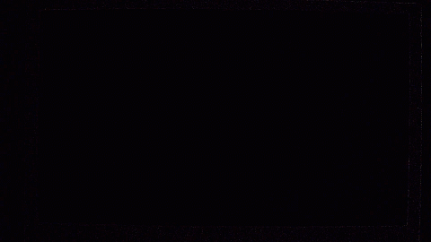

# Tang Nano 9K RGB LCD experiment

Esperimento FPGA per pilotare un pannello LCD RGB 480×272 con una Sipeed
Tang Nano 9K.

Il progetto inizializza la PSRAM integrata con un frame buffer RGB565 nero, lo
legge a burst attraverso una FIFO dual-clock e genera i segnali di timing del
display. Tramite SPI può aggiornare rettangoli o renderizzare testo usando tre
font bitmap residenti nella User Flash. Supporta double buffering, PRESENT con
IRQ e copie/scroll di viewport con riempimento RGB565 automatico. Pattern diagnostici e barre colore
restano disponibili nei test.


Il pattern diagonale diagnostico viene usato per rendere visibili disallineamenti dei pixel
e degli accessi a burst nel frame buffer.


### Demo terminale FPGA



Questa demo usa i comandi grafici implementati direttamente in hardware nella
FPGA e i font residenti nella User Flash, senza rasterizzare il testo sul
microcontrollore. Il collegamento SPI opera in mode 0: il flusso pixel
write-only `BE` raggiunge 18,75 MHz, i comandi ordinari usano 9,375 MHz e la
lettura dello stato tramite `BF` usa 1,171875 MHz.

## Struttura

- `src/TOP.sv`: integrazione di clock, PSRAM, frame buffer, FIFO e display;
- `src/FramebufferController.sv`: scrittura e lettura del frame buffer in PSRAM;
- `src/BlitRenderer.sv`: COPY e SCROLL fra front e back, con colore di riempimento;
- `src/VGA_Timing.sv`: timing RGB 480×272 e conversione RGB565;
- `src/ResetSynchronizer.sv`: reset asincrono in assert, sincrono in rilascio;
- `src/FramebufferFifo.sv`: FIFO dual-clock con almost-full pipelined;
- `src/PulseSynchronizer.sv`: trasporto di un impulso fra domini di clock;
- `src/UserFlashReader.sv`, `src/FontStore.sv`, `src/TextRenderer.sv`: lettura,
  validazione CRC e rendering dei font 8x16, 12x24 e 16x32;
- `src/LCD.cst`: assegnazione dei pin della Tang Nano 9K;
- `src/LCD.sdc`: vincoli di timing e gruppi di clock asincroni;
- `LCD.gprj`: progetto Gowin EDA;
- `build.ps1`, `program_tang_nano_sram.ps1`, `program_tang_nano_flash.ps1`:
  build e programmazione volatile o persistente con i font;
- `tools/`: gate di timing sul report Gowin, runner di processo con log e
  timeout condiviso da build e simulazione, e wrapper di `programmer_cli` che
  ne aggira le due trappole note;
- `sim/`: testbench di risincronizzazione del frame e prove negative;
- `src/gowin_rpll/`, `src/psram_memory_interface_hs/`: IP generati da Gowin EDA
  per i due PLL e per il controller PSRAM;

## Strumenti necessari

| Strumento | A cosa serve | Dove |
|---|---|---|
| **Gowin EDA** | sintesi e place-and-route | installazione locale, cercata sotto `C:\Program Files\Gowin` |
| **oss-cad-suite** | `openFPGALoader` per programmare, Icarus Verilog per simulare | <https://github.com/YosysHQ/oss-cad-suite-build/releases> |
| **Python 3** | generazione dei font e trascrizione del `.fi` | qualunque installazione nel PATH |
| STM32CubeCLT | build e caricamento del firmware STM32, letture SWD | solo per la parte MCU |

`oss-cad-suite` va scompattata e la sua `bin` resa raggiungibile; qui sta in
`C:\oss-cad-suite\bin`. Serve inoltre che l'interfaccia 0 del cavo JTAG abbia
il driver **WinUSB**, messo con Zadig: senza, `openFPGALoader` non vede la
scheda. Procedura in [PROGRAMMING.md](docs/PROGRAMMING.md).

**Apicula non serve.** Il flusso di sintesi qui è quello Gowin, e di
oss-cad-suite si usano soltanto `openFPGALoader` e Icarus Verilog. Apicula,
Yosys e nextpnr-gowin servirebbero solo per un flusso interamente open-source,
che questo progetto non usa: il controller PSRAM è un IP Gowin e andrebbe
prima sostituito con un'implementazione compatibile.

## Build e programmazione

Da PowerShell, senza aprire la GUI:

```powershell
.\build.ps1              # sintesi, place-and-route, riepilogo di timing
.\build.ps1 -Program     # e carica il bitstream al termine
```

Lo script cerca l'installazione di Gowin e fallisce in caso di report mancante,
timing fuori baseline o mancata generazione del bitstream. L'unica eccezione
ammessa riguarda i percorsi di calibrazione PSRAM documentati, entro limiti
espliciti: non vengono escluse genericamente tutte le violazioni nell'IP.
Il log completo è in `impl/build.log`; `impl/verification.json` registra
riepilogo di timing e hash del bitstream e del report.

Il dispositivo di destinazione è `GW1NR-LV9QN88PC6/I5`; il bitstream prodotto è
`impl/pnr/LCD.fs`. In alternativa si può aprire `LCD.gprj` nella GUI di Gowin
EDA e avviare sintesi e place-and-route da lì.

Per caricarlo nella SRAM volatile da PowerShell:

```powershell
.\program_tang_nano_sram.ps1
```

Per programmare insieme Embedded Flash e User Flash:

```powershell
python .\tools\generate_user_flash_fonts.py .\third_party\terminus-font-4.49.1-master .\fonts --logo .\resources\BootLogo.png
.\program_tang_nano_flash.ps1
```

Ulteriori dettagli sono in [PROGRAMMING.md](docs/PROGRAMMING.md).

Il `.gitignore` prevede anche output prodotti da Yosys, nextpnr-gowin e Apicula,
tipicamente raccolti in `build/`. Il controller PSRAM usato qui è però un IP
Gowin: per un flusso interamente open-source, come quello proposto da Lushay
Labs, questa parte deve essere sostituita con un'implementazione compatibile.


## Simulazione

`sim/` contiene un testbench che inietta un underrun della FIFO a metà area
visibile e conta quanti frame restano danneggiati dopo il guasto. Serve
Icarus Verilog (oss-cad-suite):

```powershell
.\sim\run_sim.ps1                # RTL attuale
.\sim\run_sim.ps1 -Mode model    # con la FIFO comportamentale di riferimento
.\sim\run_sim.ps1 -Mode legacy   # RTL pre-fix: dimostra il danno permanente
.\sim\run_sim.ps1 -Mode all      # regressione completa, si ferma al primo errore
.\sim\test_verification.ps1     # prove negative, dopo una build riuscita
```

Il modello di PSRAM acquisisce i dati scritti per un audit indipendente di tutti
i pixel. Le letture restituiscono una rampa derivata dall'indirizzo, per rendere
visibile ogni disallineamento del flusso video.

I test controllano due frame integri prima del guasto, l'effettivo underrun,
quattro frame successivi e i segnali video. `legacy` passa soltanto se riproduce
il danno persistente atteso; `current` e `model` devono recuperare subito.
Errori e timeout producono un codice di uscita non nullo. Un file `.vvp` di una
compilazione precedente non viene riutilizzato dopo un errore.

I log sono in `sim/build/compile_<modo>.log` e `run_<modo>.log`, con avanzamento
visibile per frame. La FIFO reale richiede diversi minuti; non è un blocco del
simulatore. Il limite di tempo reale è 900 secondi per processo, modificabile
con `-TimeoutSeconds`; resta attivo anche un timeout di 200 ms simulati.

Misure del raster, risultati e limiti della verifica sono in
[VERIFICATION.md](docs/VERIFICATION.md).

## Documentazione

| Documento | Contenuto |
|---|---|
| [GRAPHICS_COMMANDS.md](docs/GRAPHICS_COMMANDS.md) | **elenco completo dei comandi grafici**: opcode SPI e API, l'API C dell'STM32, i byte di stato e ciò che non esiste |
| [PROGRAMMING.md](docs/PROGRAMMING.md) | come si programma la scheda, quale programmatore funziona e perché, driver USB, trappole della flash |
| [VERIFICATION.md](docs/VERIFICATION.md) | comandi di verifica riproducibili, misure del raster, limiti di ciò che i test dimostrano |
| [SPI_SLAVE.md](docs/SPI_SLAVE.md) | il trasporto SPI mode 0 in `SpiSlave.sv`, indipendente dal protocollo |
| [SPI_FRAMEBUFFER.md](docs/SPI_FRAMEBUFFER.md) | protocollo dell'opcode `B7` byte per byte, arbitraggio PSRAM e CDC, diario delle prove |
| [SPI_TEXT.md](docs/SPI_TEXT.md) | protocollo dell'opcode `B8`, formato dei font in User Flash |
| [SPI_DIAGNOSTIC_RESULTS.md](docs/SPI_DIAGNOSTIC_RESULTS.md) | diagnosi dei fronti che ha portato a 12.5 MHz con GPIO `MEDIUM` |
| [SPI_STRESS.md](docs/SPI_STRESS.md) | qualifica prolungata del collegamento, e perché 25 MHz non passa |
| [SPI_PERFORMANCE.md](docs/SPI_PERFORMANCE.md) | cronologia della salita in frequenza con GPIO `VERY_HIGH`; non è la configurazione attuale |
| [LVGL_DEMO.md](docs/LVGL_DEMO.md) | demo LVGL 9 implementata sullo STM32: task, flush RGB565 e limiti del primo stadio |
| [TOUCH_BRINGUP.md](docs/TOUCH_BRINGUP.md) | cablaggio e scansione I2C del touch capacitivo su PB8/PB9 |
| [LVGL_IMPL.md](docs/LVGL_IMPL.md) | studio storico sulle possibili evoluzioni del controller grafico per LVGL |
| [BLITTER.md](docs/BLITTER.md) | COPY, SCROLL con riempimento, protocollo BC e demo terminale |
| [DOUBLE_BUFFER.md](docs/DOUBLE_BUFFER.md) | double buffering, PRESENT, IRQ, protocollo BA/BB e collaudo |
| [FREERTOS.md](docs/FREERTOS.md) | architettura delle task, proprietà SPI/FPGA, coda display, memoria DMA e misura degli stack |
| [RIPRESA.md](docs/RIPRESA.md) | punto di ripresa del lavoro: stato corrente, verifiche superate, punti ancora aperti |
| [README STM32](stm32/WeAct_H743_SPI/README.md) | cablaggio, firmware, comando unico di build, upload e collaudo |

## Grafica implementata e sviluppi futuri

**Double buffering, PRESENT al confine del frame e IRQ sono implementati.**
Due buffer PSRAM, disegno sul back e conferma dello swap su IO28 -> PB0.
Protocollo BA/BB, API e collaudo: [DOUBLE_BUFFER.md](docs/DOUBLE_BUFFER.md).


Il modulo autonomo [SpiSlave](docs/SPI_SLAVE.md) implementa il trasporto SPI
mode 0 per un master STM32 ed e' verificabile con `./sim/run_spi_sim.ps1`.
L'endpoint [SPI framebuffer](docs/SPI_FRAMEBUFFER.md) aggiunge una coda
asincrona, burst mascherati e arbitraggio PSRAM per rettangoli RGB565.
Il comando [SPI testo B8](docs/SPI_TEXT.md) aggiunge testo UTF-8 limitato,
clipping, ritorno a capo opzionale e sfondo opaco o trasparente.
Il comando B9 esegue riempimenti hardware, clear e linee orizzontali/verticali
tramite le API STM32.
`LCD_DrawLine` usa B9 tipo 1 per linee oblique con Bresenham nella FPGA.
Riferimento completo:
[GRAPHICS_COMMANDS.md](docs/GRAPHICS_COMMANDS.md).

La prima integrazione [LVGL 9](docs/LVGL_DEMO.md) e' implementata sullo STM32:
usa due draw buffer parziali, `GuiTask` e la coda di `DisplayTask` per inviare
rettangoli RGB565 al framebuffer FPGA. Ogni frame completo e' presentato al
vertical blanking, poi una COPY front-to-draw preserva la base per i flush
parziali seguenti. Lo studio [LVGL_IMPL.md](docs/LVGL_IMPL.md) conserva le
alternative architetturali.
Lo studio [BLITTING_ROP_STUDY.md](docs/BLITTING_ROP_STUDY.md) valuta copie
fra framebuffer, scroll e ROP come XOR, ancora da implementare.
La parte di presentazione ha ora un riferimento implementativo in DOUBLE_BUFFER.md.

## Licenza e attribuzione

Rilasciato sotto licenza MIT: vedi [LICENSE](LICENSE).

La struttura iniziale del progetto e il timing del pannello derivano
dall'esempio `lcd_4.3` della raccolta [Sipeed
TangNano-9K-example](https://github.com/sipeed/TangNano-9K-example). I file
sotto `src/gowin_rpll/` e `src/psram_memory_interface_hs/` sono generati dall'IP Core Generator di Gowin
EDA e restano soggetti ai termini di Gowin, non a quelli di questo progetto.

## Collegamento STM32 e collaudo SPI

Il TOP include uno slave SPI mode 0 con scrittura framebuffer e una
modalita' diagnostica selezionabile. Cablaggio, firmware DMA e comando unico di build/upload/test
sono nel [README STM32](stm32/WeAct_H743_SPI/README.md).
Il [collaudo prolungato](docs/SPI_STRESS.md) qualifica il flusso pixel
write-only a 18,75 MHz con GPIO `MEDIUM`; a 25 MHz restano errori grafici
intermittenti. Per la diagnosi precedente e i dettagli della qualifica vedere
[SPI_DIAGNOSTIC_RESULTS.md](docs/SPI_DIAGNOSTIC_RESULTS.md) e
[SPI_PERFORMANCE.md](docs/SPI_PERFORMANCE.md). La demo grafica e i suoi limiti
di verifica sono descritti in [SPI_FRAMEBUFFER.md](docs/SPI_FRAMEBUFFER.md).
