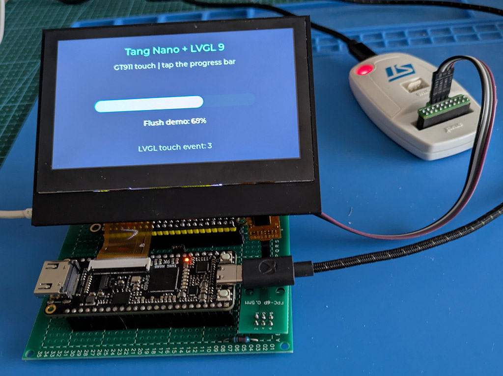

# Tang Nano 9K RGB LCD Graphics Platform

This project uses an affordable, modern FPGA on a Sipeed Tang Nano 9K to drive
a 480×272 RGB TFT IPS panel.

Its main goal is to show how an FPGA can provide an advanced display subsystem,
including LVGL 9 support, while offloading substantial work from the MCU. This
also makes the setup practical with very small microcontrollers.

The design initializes the integrated PSRAM (inside the GoWin SiP) with a black
RGB565 framebuffer, reads it in bursts through a dual-clock FIFO, and generates
the display timing signals. SPI commands can update rectangles or render text
with three bitmap fonts stored in User Flash. It supports double buffering,
frame-boundary PRESENT with an IRQ, and viewport copy/scroll with automatic
RGB565 fill. Diagnostic patterns and color bars remain available for testing.




The diagonal diagnostic pattern makes pixel and framebuffer burst-access
misalignment visible.


### FPGA terminal demo


This demo uses graphics commands implemented directly in hardware and fonts
stored in User Flash, with no text rasterization on the microcontroller. The
SPI link uses mode 0: the write-only `BE` pixel stream runs at 18.75 MHz,
regular commands use 9.375 MHz, and `BF` status reads use 1.171875 MHz.

### LVGL touch demo

The LVGL demo integrates the GT911 capacitive touch controller driver as a
pointer input. The firmware polls it every 10 ms, automatically scales the
coordinates to the 480x272 LCD resolution, and forwards events to LVGL. The
progress bar provides a visible way to check touch and release events.


I2C wiring, controller detection, and SWD diagnostic registers are described in
[TOUCH_BRINGUP.md](docs/TOUCH_BRINGUP.md).

## Project structure

- `src/TOP.sv`: integrates the clocks, PSRAM, framebuffers, FIFO, and display;
- `src/FramebufferController.sv`: writes and reads the framebuffer in PSRAM;
- `src/BlitRenderer.sv`: COPY and SCROLL between front and back buffers, with a fill color;
- `src/VGA_Timing.sv`: 480x272 RGB timing and RGB565 conversion;
- `src/ResetSynchronizer.sv`: asynchronous reset assertion and synchronous release;
- `src/FramebufferFifo.sv`: dual-clock FIFO with a pipelined almost-full signal;
- `src/PulseSynchronizer.sv`: transfers a pulse between clock domains;
- `src/UserFlashReader.sv`, `src/FontStore.sv`, `src/TextRenderer.sv`: reads,
  CRC validation, and rendering for 8x16, 12x24, and 16x32 fonts;
- `src/LCD.cst`: Tang Nano 9K pin assignments;
- `src/LCD.sdc`: timing constraints and asynchronous clock groups;
- `LCD.gprj`: Gowin EDA project;
- `build.ps1`, `program_tang_nano_sram.ps1`, `program_tang_nano_flash.ps1`:
  build and volatile or persistent programming, including the fonts;
- `tools/`: Gowin timing-report checks, a shared logged process runner with
  timeouts for builds and simulations, and a `programmer_cli` wrapper that
  works around its two known pitfalls;
- `sim/`: frame-resynchronization testbenches and negative tests;
- `src/gowin_rpll/`, `src/psram_memory_interface_hs/`: Gowin EDA-generated IP
  for the two PLLs and the PSRAM controller;

## Required tools

| Tools | Purpose | Location |
|---|---|---|
| **Gowin EDA** | synthesis and place-and-route | local installation, searched for under `C:\Program Files\Gowin` |
| **oss-cad-suite** | `openFPGALoader` for programming and Icarus Verilog for simulation | <https://github.com/YosysHQ/oss-cad-suite-build/releases> |
| **Python 3** | font generation and `.fi` conversion | any installation on `PATH` |
| STM32CubeCLT | STM32 firmware build and upload, plus SWD reads | only needed for the MCU side |

Extract `oss-cad-suite` and add its `bin` directory to `PATH`; this project
expects it at `C:\oss-cad-suite\bin`. Interface 0 of the JTAG cable also needs
the **WinUSB** driver, installed with Zadig. Without it, `openFPGALoader` will
not detect the board. See [PROGRAMMING.md](docs/PROGRAMMING.md) for the setup.

**Apicula is not required.** Synthesis uses the Gowin flow, while this project
only uses `openFPGALoader` and Icarus Verilog from oss-cad-suite. Apicula, Yosys,
and nextpnr-gowin would be needed only for a fully open-source flow, which this
project does not use: the PSRAM controller is Gowin IP and would first need to
be replaced with a compatible implementation.

## Build and programming

From PowerShell, without opening the GUI:

```powershell
.\build.ps1              # synthesis, place-and-route, timing summary
.\build.ps1 -Program     # and load the bitstream when finished
```

The script locates the Gowin installation and fails if a report is missing,
timing is outside the baseline, or the bitstream is not generated. The only
allowed exception covers documented PSRAM calibration paths within their
known slack floor; it does not blanket-ignore all violations in the IP. The full log is
in `impl/build.log`; `impl/verification.json` records timing summaries and
hashes for the bitstream and report.

The target device is `GW1NR-LV9QN88PC6/I5`; the generated bitstream is
`impl/pnr/LCD.fs`. Alternatively, open `LCD.gprj` in the Gowin EDA GUI and run
synthesis and place-and-route there.

To load it into volatile SRAM from PowerShell:

```powershell
.\program_tang_nano_sram.ps1
```

To program both Embedded Flash and User Flash:

```powershell
python .\tools\generate_user_flash_fonts.py .\third_party\terminus-font-4.49.1-master .\fonts --logo .\resources\BootLogo.png
.\program_tang_nano_flash.ps1
```

More details are available in [PROGRAMMING.md](docs/PROGRAMMING.md).

`.gitignore` also covers output from Yosys, nextpnr-gowin, and Apicula, usually
collected in `build/`. The PSRAM controller used here is Gowin IP, however, so
a fully open-source flow such as the one proposed by Lushay Labs would require
replacing it with a compatible implementation.


## Simulation

`sim/` contains a testbench that injects a FIFO underrun halfway through the
visible area and counts how many frames remain damaged after the fault. It uses
Icarus Verilog from oss-cad-suite:

```powershell
.\sim\run_sim.ps1                # current RTL
.\sim\run_sim.ps1 -Mode model    # with the reference behavioral FIFO
.\sim\run_sim.ps1 -Mode legacy   # pre-fix RTL: demonstrates permanent damage
.\sim\run_sim.ps1 -Mode all      # full regression, stops at the first error
.\sim\test_verification.ps1     # negative tests, after a successful build
```

The PSRAM model captures written data for an independent audit of every pixel.
Reads return an address-derived ramp, making any video-stream misalignment
visible.

The tests check two intact frames before the fault, the actual underrun, four
following frames, and the video signals. `legacy` passes only when it reproduces
the expected persistent damage; `current` and `model` must recover immediately.
Errors and timeouts produce a non-zero exit code. A `.vvp` file from an earlier
compilation is not reused after an error.

Logs are written to `sim/build/compile_<mode>.log` and `run_<mode>.log`, with
per-frame progress shown on the console. The real FIFO takes several minutes;
this is not a simulator hang. The wall-clock limit is 900 seconds per process
and can be changed with `-TimeoutSeconds`; a simulated 200 ms timeout remains
active as well.

Raster measurements, results, and verification limits are documented in
[VERIFICATION.md](docs/VERIFICATION.md).

## Documentation

| Document | Contents |
|---|---|
| [GRAPHICS_COMMANDS.md](docs/GRAPHICS_COMMANDS.md) | **complete graphics command reference**: SPI opcodes and APIs, the STM32 C API, status bytes, and unsupported features |
| [PROGRAMMING.md](docs/PROGRAMMING.md) | how to program the board, which programmer works and why, USB drivers, and flash pitfalls |
| [VERIFICATION.md](docs/VERIFICATION.md) | reproducible verification commands, raster measurements, and test limitations |
| [SPI_SLAVE.md](docs/SPI_SLAVE.md) | protocol-independent SPI mode 0 transport in `SpiSlave.sv` |
| [SPI_FRAMEBUFFER.md](docs/SPI_FRAMEBUFFER.md) | byte-level `B7` opcode protocol, PSRAM arbitration and CDC, and test notes |
| [SPI_TEXT.md](docs/SPI_TEXT.md) | `B8` opcode protocol and User Flash font format |
| [SPI_DIAGNOSTIC_RESULTS.md](docs/SPI_DIAGNOSTIC_RESULTS.md) | edge diagnostics that led to 12.5 MHz with `MEDIUM` GPIO drive |
| [SPI_STRESS.md](docs/SPI_STRESS.md) | extended link qualification and why 25 MHz does not pass |
| [SPI_PERFORMANCE.md](docs/SPI_PERFORMANCE.md) | frequency ramp-up history with `VERY_HIGH` GPIO drive; not the current configuration |
| [TOUCH_BRINGUP.md](docs/TOUCH_BRINGUP.md) | capacitive-touch wiring and I2C scan on PB8/PB9 |
| [HARDWARE.md](docs/HARDWARE.md) | Mermaid diagram and wiring table for the STM32, Tang Nano, display, and touch controller |
| [BLITTER.md](docs/BLITTER.md) | COPY, SCROLL with fill, BC protocol, and terminal demo |
| [DOUBLE_BUFFER.md](docs/DOUBLE_BUFFER.md) | double buffering, PRESENT, IRQ, BA/BB protocol, and validation |
| [FREERTOS.md](docs/FREERTOS.md) | task architecture, SPI/FPGA properties, display queue, DMA memory, and stack measurements |
| [STM32 README](stm32/WeAct_H743_SPI/README.md) | wiring, firmware, one-command build, upload, and test workflow |

## Implemented graphics and future work

**Double buffering, frame-boundary PRESENT, and IRQ are implemented.**
Two PSRAM buffers are used for drawing on the back buffer, with swap
confirmation on IO28 -> PB0. Protocol, API, and validation:
[DOUBLE_BUFFER.md](docs/DOUBLE_BUFFER.md).


The standalone [SpiSlave](docs/SPI_SLAVE.md) module implements SPI mode 0
transport for an STM32 master and can be tested with `./sim/run_spi_sim.ps1`.
The [SPI framebuffer](docs/SPI_FRAMEBUFFER.md) endpoint adds an asynchronous
queue, masked bursts, and PSRAM arbitration for RGB565 rectangles.
The [B8 SPI text](docs/SPI_TEXT.md) command adds limited UTF-8 text, clipping,
optional line wrapping, and opaque or transparent backgrounds.
Command B9 performs hardware fills, clears, and horizontal or vertical lines
through the STM32 APIs. `LCD_DrawLine` uses B9 type 1 for diagonal lines with
Bresenham implemented in the FPGA. Complete reference:
[GRAPHICS_COMMANDS.md](docs/GRAPHICS_COMMANDS.md).

The first LVGL 9 integration is implemented on the STM32:
it uses two partial draw buffers, `GuiTask`, and the `DisplayTask` queue to send
RGB565 rectangles to the FPGA framebuffer. Each complete frame is presented at
vertical blanking, then a front-to-draw COPY preserves the base for subsequent
partial flushes.
The presentation path now has an implementation reference in
[DOUBLE_BUFFER.md](docs/DOUBLE_BUFFER.md).

## License and attribution

Released under the MIT license: see [LICENSE](LICENSE).

The initial project structure and panel timing are based on the `lcd_4.3`
example from the [Sipeed
TangNano-9K-example](https://github.com/sipeed/TangNano-9K-example). The files
under `src/gowin_rpll/` and `src/psram_memory_interface_hs/` are generated by
the Gowin EDA IP Core Generator and remain subject to Gowin's terms, not this
project's terms.

## STM32 connection and SPI testing

TOP includes an SPI mode 0 slave with framebuffer writes and a selectable
diagnostic mode. Wiring, DMA firmware, and the one-command build/upload/test
workflows are in the [STM32 README](stm32/WeAct_H743_SPI/README.md).
The [extended test](docs/SPI_STRESS.md) qualifies the SPI link at 12.5 MHz
with `MEDIUM` GPIO drive; intermittent graphics errors remain at
25 MHz. For earlier diagnostics and qualification details, see
[SPI_DIAGNOSTIC_RESULTS.md](docs/SPI_DIAGNOSTIC_RESULTS.md) and
[SPI_PERFORMANCE.md](docs/SPI_PERFORMANCE.md). The graphics demo and its
verification limits are described in [SPI_FRAMEBUFFER.md](docs/SPI_FRAMEBUFFER.md).
