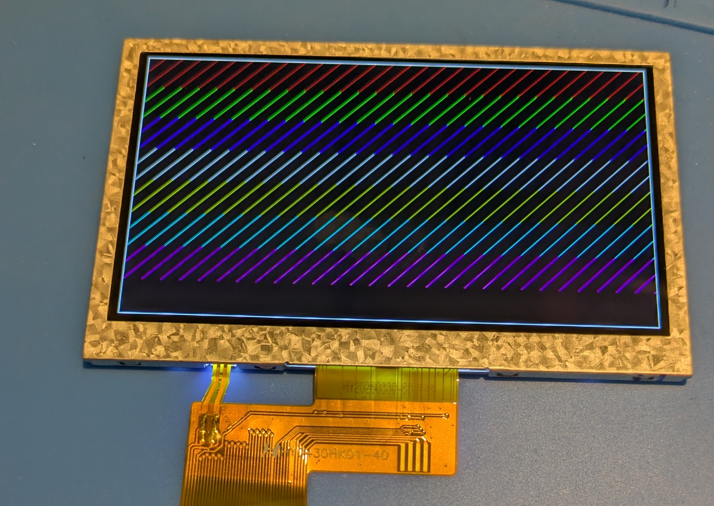

# Tang Nano 9K RGB LCD experiment

Esperimento FPGA per pilotare un pannello LCD RGB 480×272 con una Sipeed
Tang Nano 9K.

Il progetto inizializza la PSRAM integrata con un frame buffer RGB565 nero, lo
legge a burst attraverso una FIFO dual-clock e genera i segnali di timing del
display. Tramite SPI può aggiornare rettangoli o renderizzare testo usando due
font bitmap residenti nella User Flash. Pattern diagnostici e barre colore
restano disponibili nei test.


Il pattern diagonale diagnostico viene usato per rendere visibili disallineamenti dei pixel
e degli accessi a burst nel frame buffer.



## Struttura

- `src/TOP.sv`: integrazione di clock, PSRAM, frame buffer, FIFO e display;
- `src/FramebufferController.sv`: scrittura e lettura del frame buffer in PSRAM;
- `src/VGA_Timing.sv`: timing RGB 480×272 e conversione RGB565;
- `src/ResetSynchronizer.sv`: reset asincrono in assert, sincrono in rilascio;
- `src/FramebufferFifo.sv`: FIFO dual-clock con almost-full pipelined;
- `src/PulseSynchronizer.sv`: trasporto di un impulso fra domini di clock;
- `src/UserFlashReader.sv`, `src/FontStore.sv`, `src/TextRenderer.sv`: lettura,
  validazione CRC e rendering dei font 8x16 e 12x24;
- `src/LCD.cst`: assegnazione dei pin della Tang Nano 9K;
- `src/LCD.sdc`: vincoli di timing e gruppi di clock asincroni;
- `LCD.gprj`: progetto Gowin EDA;
- `build.ps1`, `program_tang_nano_sram.ps1`, `program_tang_nano_flash.ps1`:
  build e programmazione volatile o persistente con i font;
- `tools/`: gate di timing sul report Gowin, runner di processo con log e
  timeout condiviso da build e simulazione, e wrapper di `programmer_cli` che
  ne aggira le due trappole note;
- `sim/`: testbench di risincronizzazione del frame e prove negative;
- `src/gowin_rpll/`, `src/psram_memory_interface_hs/`: IP generati da Gowin EDA
  per i due PLL e per il controller PSRAM;

## Build e programmazione

Da PowerShell, senza aprire la GUI:

```powershell
.\build.ps1              # sintesi, place-and-route, riepilogo di timing
.\build.ps1 -Program     # e carica il bitstream al termine
```

Lo script cerca l'installazione di Gowin e fallisce in caso di report mancante,
timing fuori baseline o mancata generazione del bitstream. L'unica eccezione
ammessa riguarda i percorsi di calibrazione PSRAM documentati, entro limiti
espliciti: non vengono escluse genericamente tutte le violazioni nell'IP.
Il log completo è in `impl/build.log`; `impl/verification.json` registra
riepilogo di timing e hash del bitstream e del report.

Il dispositivo di destinazione è `GW1NR-LV9QN88PC6/I5`; il bitstream prodotto è
`impl/pnr/LCD.fs`. In alternativa si può aprire `LCD.gprj` nella GUI di Gowin
EDA e avviare sintesi e place-and-route da lì.

Per caricarlo nella SRAM volatile da PowerShell:

```powershell
.\program_tang_nano_sram.ps1
```

Per programmare insieme Embedded Flash e User Flash:

```powershell
python .\tools\generate_user_flash_fonts.py .\third_party\terminus-font-4.49.1-master .\fonts
.\program_tang_nano_flash.ps1
```

Ulteriori dettagli sono in [PROGRAMMING.md](docs/PROGRAMMING.md).

Il `.gitignore` prevede anche output prodotti da Yosys, nextpnr-gowin e Apicula,
tipicamente raccolti in `build/`. Il controller PSRAM usato qui è però un IP
Gowin: per un flusso interamente open-source, come quello proposto da Lushay
Labs, questa parte deve essere sostituita con un'implementazione compatibile.


## Simulazione

`sim/` contiene un testbench che inietta un underrun della FIFO a metà area
visibile e conta quanti frame restano danneggiati dopo il guasto. Serve
Icarus Verilog (oss-cad-suite):

```powershell
.\sim\run_sim.ps1                # RTL attuale
.\sim\run_sim.ps1 -Mode model    # con la FIFO comportamentale di riferimento
.\sim\run_sim.ps1 -Mode legacy   # RTL pre-fix: dimostra il danno permanente
.\sim\run_sim.ps1 -Mode all      # regressione completa, si ferma al primo errore
.\sim\test_verification.ps1     # prove negative, dopo una build riuscita
```

Il modello di PSRAM acquisisce i dati scritti per un audit indipendente di tutti
i pixel. Le letture restituiscono una rampa derivata dall'indirizzo, per rendere
visibile ogni disallineamento del flusso video.

I test controllano due frame integri prima del guasto, l'effettivo underrun,
quattro frame successivi e i segnali video. `legacy` passa soltanto se riproduce
il danno persistente atteso; `current` e `model` devono recuperare subito.
Errori e timeout producono un codice di uscita non nullo. Un file `.vvp` di una
compilazione precedente non viene riutilizzato dopo un errore.

I log sono in `sim/build/compile_<modo>.log` e `run_<modo>.log`, con avanzamento
visibile per frame. La FIFO reale richiede diversi minuti; non è un blocco del
simulatore. Il limite di tempo reale è 900 secondi per processo, modificabile
con `-TimeoutSeconds`; resta attivo anche un timeout di 200 ms simulati.

Misure del raster, risultati e limiti della verifica sono in
[VERIFICATION.md](docs/VERIFICATION.md).

## Sviluppi futuri

Il modulo autonomo [SpiSlave](docs/SPI_SLAVE.md) implementa il trasporto SPI
mode 0 per un master STM32 ed e' verificabile con `./sim/run_spi_sim.ps1`.
L'endpoint [SPI framebuffer](docs/SPI_FRAMEBUFFER.md) aggiunge una coda
asincrona, burst mascherati e arbitraggio PSRAM per rettangoli RGB565.
Il comando [SPI testo B8](docs/SPI_TEXT.md) aggiunge testo UTF-8 limitato,
clipping, ritorno a capo opzionale e sfondo opaco o trasparente.

[LVGL_IMPL.md](docs/LVGL_IMPL.md) raccoglie uno studio speculativo su come
trasformare la scheda in un controller grafico SPI pilotabile da un
microcontrollore con LVGL. Non descrive funzionalità presenti nel codice.

## Licenza e attribuzione

Rilasciato sotto licenza MIT: vedi [LICENSE](LICENSE).

La struttura iniziale del progetto e il timing del pannello derivano
dall'esempio `lcd_4.3` della raccolta [Sipeed
TangNano-9K-example](https://github.com/sipeed/TangNano-9K-example). I file
sotto `src/gowin_rpll/` e `src/psram_memory_interface_hs/` sono generati dall'IP Core Generator di Gowin
EDA e restano soggetti ai termini di Gowin, non a quelli di questo progetto.

## Collegamento STM32 e collaudo SPI

Il TOP include uno slave SPI mode 0 con scrittura framebuffer e una
modalita' diagnostica selezionabile. Cablaggio, firmware DMA e comando unico di build/upload/test
sono nel [README STM32](stm32/WeAct_H743_SPI/README.md).
Il [collaudo prolungato](docs/SPI_STRESS.md) passa a 12.5 MHz MEDIUM; a 25 MHz
restano errori grafici intermittenti. Per la diagnosi
precedente e le prove lunghe a 12.5 MHz vedere
[SPI_DIAGNOSTIC_RESULTS.md](docs/SPI_DIAGNOSTIC_RESULTS.md). La nuova demo
grafica e i suoi limiti di verifica sono descritti in
[SPI_FRAMEBUFFER.md](docs/SPI_FRAMEBUFFER.md).
