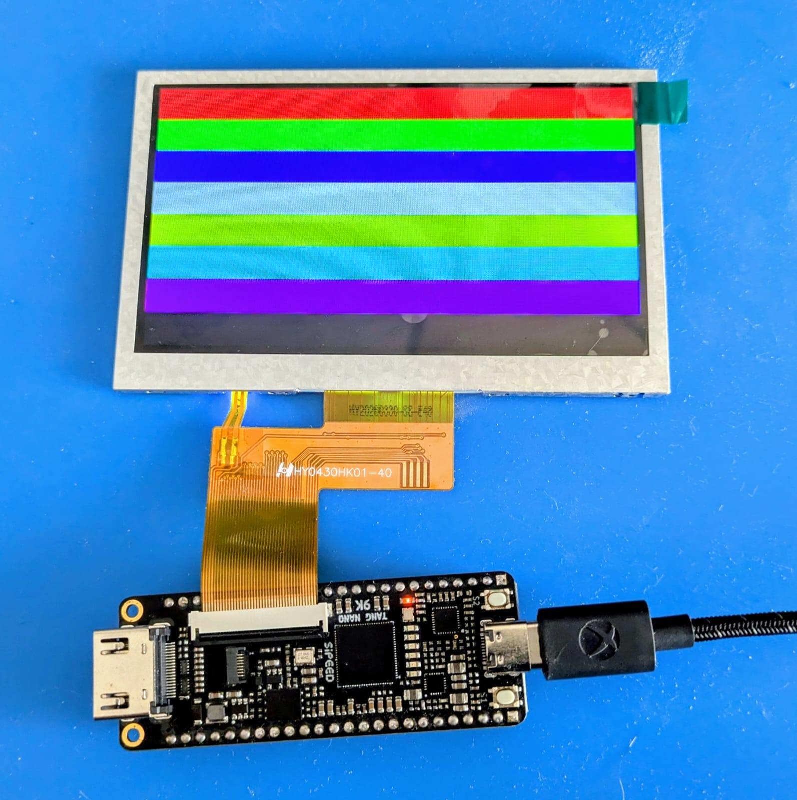

# Tang Nano 9K RGB LCD experiment

Esperimento FPGA per pilotare un pannello LCD RGB 480×272 con una Sipeed
Tang Nano 9K.

Il progetto inizializza la PSRAM integrata con un frame buffer RGB565, lo legge
a burst attraverso una FIFO dual-clock e genera i segnali di timing del display.
Il pattern corrente è formato da otto barre orizzontali colorate, alte 34 righe.



## Struttura

- `src/TOP.sv`: integrazione di clock, PSRAM, frame buffer, FIFO e display;
- `src/FramebufferController.sv`: scrittura e lettura del frame buffer in PSRAM;
- `src/VGA_Timing.sv`: timing RGB 480×272 e conversione RGB565;
- `src/LCD.cst`: assegnazione dei pin della Tang Nano 9K;
- `LCD.gprj`: progetto Gowin EDA.

## Build e programmazione

Il flusso attualmente verificato usa Gowin EDA per il dispositivo
`GW1NR-LV9QN88PC6/I5`. Aprire `LCD.gprj` e avviare sintesi e place-and-route;
il bitstream risultante è `impl/pnr/LCD.fs`.

Per caricarlo nella SRAM volatile da PowerShell:

```powershell
.\program_tang_nano_sram.ps1
```

Ulteriori dettagli sono in [PROGRAMMING.md](PROGRAMMING.md).

Il `.gitignore` prevede anche output prodotti da Yosys, nextpnr-gowin e Apicula,
tipicamente raccolti in `build/`. Il controller PSRAM usato qui è però un IP
Gowin: per un flusso interamente open-source, come quello proposto da Lushay
Labs, questa parte deve essere sostituita con un'implementazione compatibile.

