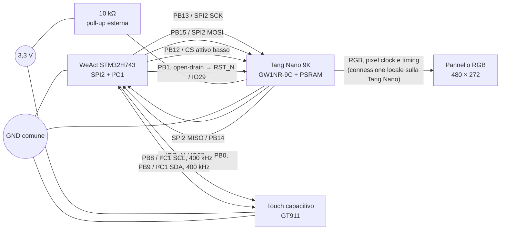
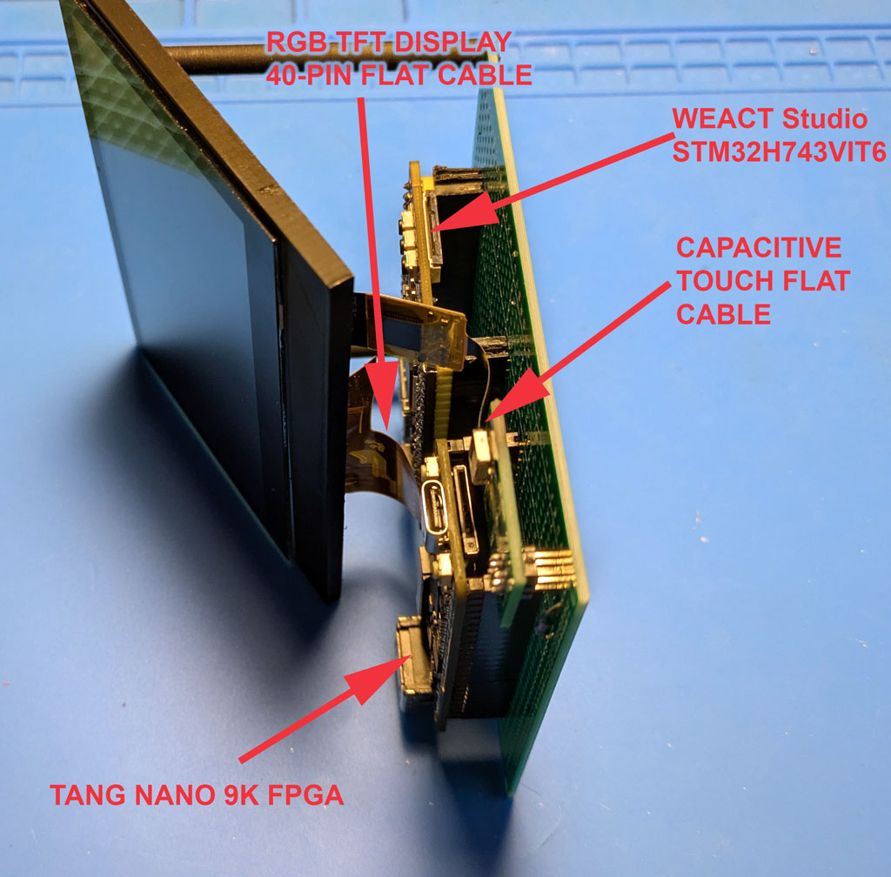
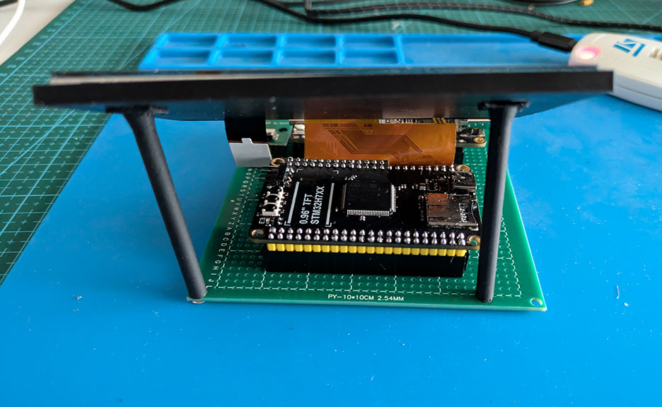
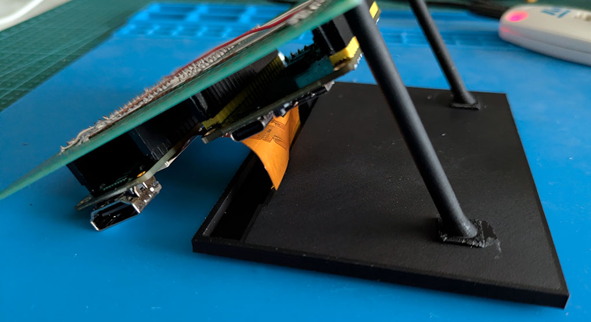
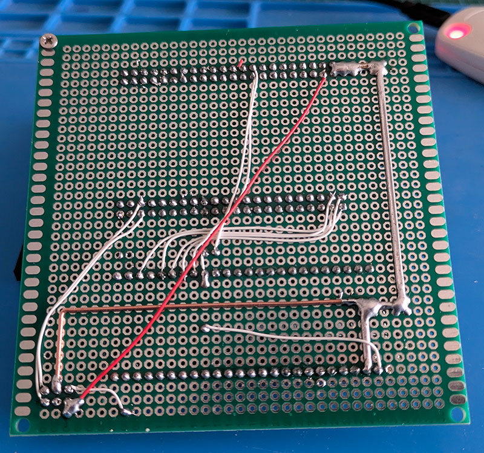

# Cablaggio del prototipo

Questo schema descrive il cablaggio effettivamente usato dal firmware e dai
vincoli FPGA. Non è uno schema PCB: i numeri `IO` della Tang Nano sono quelli
del chip, non le posizioni del connettore.

## Prototipo filato

La vista annotata rende espliciti i quattro sottosistemi del banco di prova:
display RGB e touch sono collegati localmente alla Tang Nano, mentre la WeAct
comunica con FPGA e touch rispettivamente via SPI e I²C.

Il display usa il proprio flat RGB a 40 contatti. La foto dal basso chiarisce
che non esiste un cablaggio RGB aggiuntivo fra STM32 e pannello.

## Tabella collegamenti

| Funzione | STM32H743 | Tang Nano 9K | Nota |
|---|---|---|---|
| SPI clock | PB13, SPI2 SCK | IO36 | IO36 è condiviso con il clock microSD: lasciare lo slot vuoto. |
| SPI MOSI | PB15, SPI2 MOSI | IO25 | MCU → FPGA. |
| SPI MISO | PB14, SPI2 MISO | IO26 | FPGA → MCU; il driver FPGA è tri-state a CS alto. |
| SPI CS | PB12, GPIO | IO27 | Attivo basso, gestito dal firmware. |
| PRESENT IRQ | PB0, EXTI0 | IO28 | Attivo basso; resta basso fino all'ACK SPI. |
| Reset logico FPGA | PB1, open-drain | IO29 | Pull-up esterna 10 kΩ verso 3,3 V sul lato Tang Nano. |
| Touch I²C clock | PB8, I²C1 SCL | CTP-SCL | Bus a 400 kHz. |
| Touch I²C dati | PB9, I²C1 SDA | CTP-SDA | GT911 a indirizzo 7-bit `0x5D`. |
| Touch alimentazione | — | CTP-VCC | 3,3 V. |
| Massa | GND | GND / CTP-GND | Obbligatoria fra tutte le schede. |

## Touch: linee deliberate non collegate

`CTP-INT` non è collegato: il driver GT911 usa polling ogni 10 ms. `CTP-RST`
è tenuto alto a 3,3 V nel prototipo e **non** va collegato a `FPGA_RST_N`; se
in futuro servirà il reset o l'interrupt del touch, assegnare GPIO STM32
dedicati e aggiornare qui lo schema.

## Cablaggio a filo

Il prototipo è montato su basetta millefori; i cavetti riguardano soltanto le
linee elencate nella tabella e la massa comune. La foto laterale mostra anche
il passaggio del flat del touch; quella dal basso documenta la realizzazione
manuale, non introduce collegamenti ulteriori.

## Alimentazione e limiti

STM32 e Tang Nano possono essere alimentate da USB separate; non unire le loro
rail 5 V o 3,3 V. La massa comune è invece necessaria. Il display è connesso
localmente alla Tang Nano e non richiede fili RGB verso la STM32: quest'ultima
invia soltanto comandi e pixel attraverso SPI.

Il pulsante di reset della Tang Nano usa IO4 nel banco a 1,8 V. Per questo il
reset comandato dalla MCU usa IO29, che è in un banco a 3,3 V, e resta un reset
logico della FPGA/PSRAM, non una riconfigurazione del bitstream.
