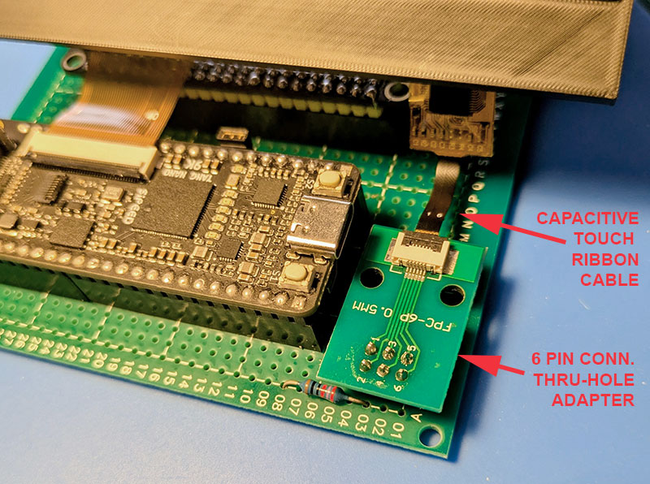

# Bring-up capacitive touch

The six-contact touch connector uses 3.3V logic:

| Signal | STM32 / prototype |
| --- | --- |
| `CTP-RST` | pull-up to 3.3V during first bring-up; a dedicated GPIO later |
| `CTP-VCC` | 3.3V |
| `CTP-GND` | GND |
| `CTP-INT` | not connected in the first test; future dedicated GPIO EXTI |
| `CTP-SDA` | `PB9`, I2C1 SDA |
| `CTP-SCL` | `PB8`, I2C1 SCL |

`I2C1` is initialized at 400 kHz. The service task runs a single scan of
7-bit I2C addresses from `0x08` to `0x77`, without sending any
controller-specific commands. The SWD results are:

- `g_touch_probe_state`: `2` when the scan is finished;
- `g_touch_probe_found`: number of addresses that ACK;
- `g_touch_probe_addresses[4]`: bitmap of the addresses that ACK;
- `g_touch_probe_bus_error`: last timeout/bus error, `0` if absent;
- `g_touch_probe_product_id`: four ASCII bytes read from the read-only
  Goodix register `0x8140` when the typical address `0x5D` responds.

The first address found identifies the controller family from which the
LVGL driver is derived. Do not connect `CTP-RST` to the FPGA reset line:
the touch must be resettable independently.

## LVGL GT911 driver

With the Product ID detected as `911` at address `0x5D`, the firmware
registers a Pointer-type LVGL input device polled every 10 ms. It reads
status from `0x814E`, the first point from `0x814F`, and acknowledges each
frame to the GT911 by writing zero to status. Each point record is 8 bytes
starting at `0x814F` and uses little-endian coordinates. The driver scales
the detected native sensor resolution (480 x 272 on the tested module) to
the display resolution automatically; SWD data `g_gt911_sensor_width` and
`g_gt911_sensor_height` let you check or correct physical orientation
later. The demo drives a clickable progress bar to visually confirm
delivery of the event to LVGL.
